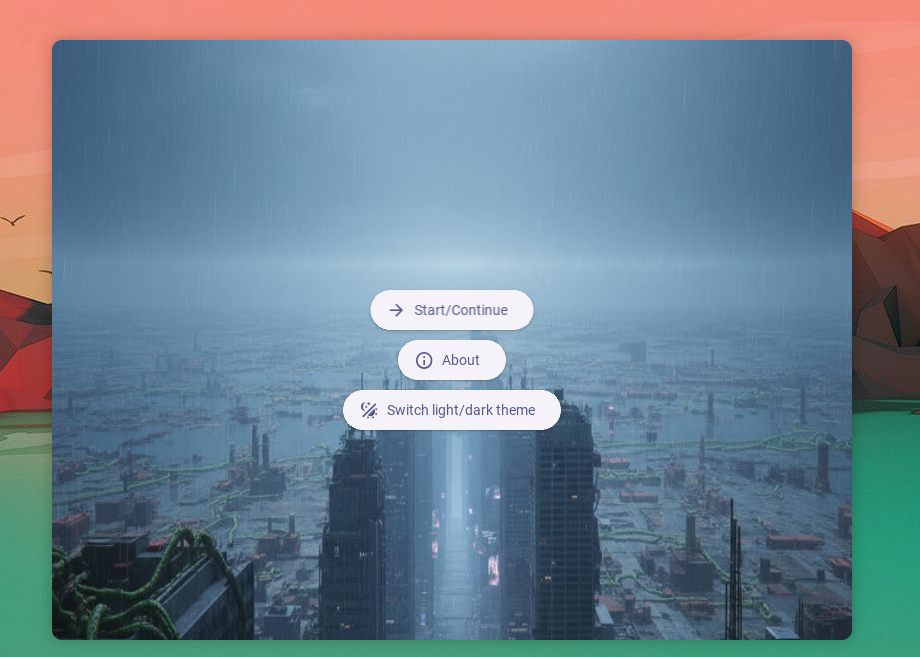
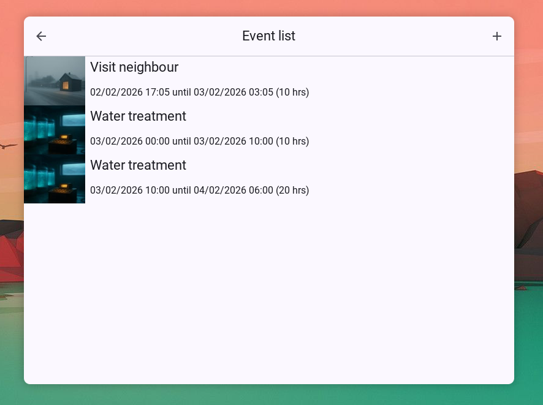
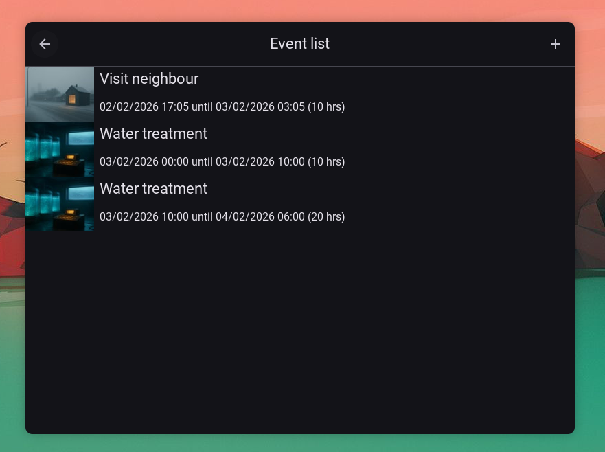
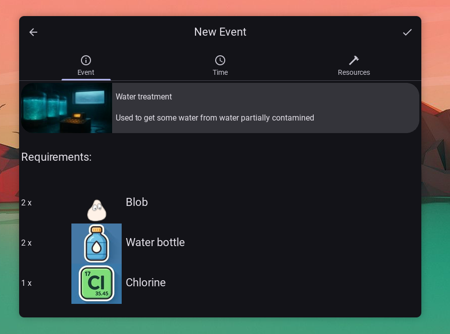

# Blobs

Este es mi (intento de) proyecto de programación de primer semestre de Ciencias de la Computación.

La motivación es hacer un administrador de tareas para Blobs (que son ¿criaturas?) de un mundo futurista y distópico. Ellos viven en una ciudad en ruinas pero con gran avance tecnológico donde la contaminación ambiental no permite la vida, al menos por más de tres horas fuera de sus casas (o más bien puntos de aglomeración.)

De los que habla este proyecto viven en los restos de un edificio, que cuenta con lo suficiente para generar electricidad, agua y comida. Además que cuentan con (escasos) vecinos a no muy larga distancia.

El principal objeto de este proyecto es organizarles un poco la vida a esos Blobs.

# Tabla de contenidos

* [Descripción general](#descripción-general)
* [Nota sobre KivyMD](#nota-sobre-kivymd)
* [Ejecutar](#ejecutar)
* [Decisiones tomadas antes/durante el desarrollo](#decisiones-tomadas-antesdurante-el-desarrollo)
* [Algoritmo para buscar colisiones y huecos](#algoritmo-para-buscar-colisiones-y-huecos)
* [Galería](#galería)
* [Transparencia sobre el uso de IA](#transparencia-sobre-el-uso-de-ia)
* [Licencia](#licencia)

# Descripción general

El proyecto traté de mantener una estructura lo más sencilla posible. Este es el árbol de archivos (vía `tree(1)`):

```
.
├── core
│   ├── coldetect.py
│   ├── events.py
│   ├── event_templates.py
│   ├── holefind.py
│   ├── __init__.py
│   ├── main.kv
│   ├── resources.py
│   └── ui
│       ├── about_screen.kv
│       ├── new_event_screen.kv
│       ├── overview_screen.kv
│       └── start_screen.kv
├── icons.py
├── main.py
├── Makefile
├── pyproject.toml
├── README.md
├── res
│   ├── (Imágenes y demás recursos)
│   └── (...)
└── uv.lock
```

Desglose por archivos:

* `core`: Aquí se encuentra la totalidad de la lógica de la app
    * `coldetect.py`: Donde se encuentra la verificación de colisiones de eventos, así como la verificación de las restricciones de inclusión y exclusión de cada recurso.
    * `events.py`: La parte que se encarga de la persistencia de los eventos creados (guardar/cargar el archivo JSON)
    * `event_templates.py`: Las plantillas para crear eventos. Estas no son mas que eventos que pueden hacer los Blobs, asociados con los recursos que necesitas al menos.
    * `holefind.py`: Pequeñisimo archivo donde se encuentra la lógica de buscar hueco para un evento, tal como se especificara en la descripción del proyecto dada por los profesores.
    * `__init__.py`: Solo va la parte controladora de la UI (controladora aquí no se refiere a que seguí el patrón MVC, sino que literalmente y muy suciamente usa la UI sin seguir ningún patrón en particular)
    * `main.kv`: Especificación para Kivy de las vistas de la app (Start, Overview, About, NewEvent)
    * `resources.py`: Al igual que `core/event_templates.py`, contiene la declaración de los recursos que se pueden usar, así como sus respectivas restricciones.
    * `ui`: Este directorio completo es únicamente la especificación para Kivy de toda la interfaz
        * `about_screen.kv`: La pantalla del 'acerca de'
        * `new_event_screen.kv`: La pantalla de 'nuevo evento'
        * `overview_screen.kv`: La lista de eventos existentes y su información
        * `start_screen.kv`: La pantalla inicial
* `icons.py`: Herramienta (sacada de la documentación de KivyMD) para listar y filtrar los iconos de Material disponibles
* `main.py`: Entrypoint del programa, lo que debes ejecutar
* `Makefile`: Por ahora solo contiene lo de clonar KivyMD, mirar la sección sgte.
* `pyproject.toml`: Especificaciones (como version, nombre y demás) del proyecto
* `README.md`: Esto
* `res`: Este directorio contiene los recursos (imágenes y demás usados en la app)
* `uv.lock`: Cosa de UV, ignorar

# Nota sobre KivyMD

Al parecer hay un error en el wheel de kivymd que no incluye sus archivos .kv y causa error, por tanto para poder usarlo es necesario clonar el repositorio y usarlo directamente. Idealmente se podria hacerle checkout a una versión en específicamente pero bueno, tarea para más adelante. Es suficiente con correr:

```sh
make kivymd
```

Claro, asegúrate de tener `make(1)` instalado

# Ejecutar

Recomendado usar UV,te simplifica muchisimo la vida (además de que está hecho en Rust btw ;) ), basta con correr:

```sh
uv run main.py
```

Y se encarga de crear el entorno virtual y todo lo demás, en caso de no tener o querer usarlo, debes crear un entorno virtual, cargarlo e instalar las dependencias necesarias:

```
python3 -m venv env
. env/bin/activate
# Alternativamente si usas fish
# . env/bin/activate.fish
python3 -m pip install 'kivy==2.3.1' 'asynckivy==0.9.3' 'materialyoucolor==2.0.10'

# Ejecutas
python3 main.py
```

# Decisiones tomadas antes/durante el desarrollo

Sobre kivy: Resulta que entre todas las opciones para interfaces gráficas Kivy es la mejor, aparte de ser varios ordenes de magnitud más sencilla que algunas de sus alternativas, resulta agradable programar en ella, viene con una lista bien grande de widgets pre-hechos y es super personalizable, ademas que te permite separar la lógica de la interfaz (gracias a los archivos kv)

Sobre kivymd: Bueno, una vez ya con kivy me mataba la idea de hacer algo siguiendo las líneas guía de Material Design, que permite hacer interfaces simples, bonitas, intuitivas y con poco ruido visual con extrema facilidad. Pues resulta que existía KivyMD, y ya viene con practicamente todos los componentes necesarios y con solo leer treinta (30) minutos su documentación ya era suficiente para crear algo que valiese la pena.

Sobre separar los kv y la lógica: Resulta que la parte más trabajosa del proyecto no es manejar los eventos per se, sino la parte de la interfas, y llegado un punto, la parte ocupada de la interfaz era tan compleja que se hacía increiblemente molesto tener la lógica y la interfaz junta.

¿Por qué no seguir un patrón MVVM/MVP/MVC? Realmente me pesaba, lo siento.

Los eventos son una lista de plantillas predefinidas porque así resulta más sencillo e intuitivo, punto.

Lo demás es tal como decía en la especificación del proyecto, los recursos se agrupan por cantidad, hay restricciones excluyentes e incluyentes entre ellos, así como restricciones entre eventos. Esta última es pues, hay una cantidad limitada de recursos, y dos eventos están en conflicto si llegasen a usar 

# Algoritmo para buscar colisiones y huecos

Primero, definimos que existe una colisión como la existencia de un instante de tiempo en el cual, se están utilizando por algunos eventos más de los recursos que existen (cuya cantidad esta en el archivo `core/resources.py`)

Para detectar colisión basta con mirar el inicio de cada recurso y verificar los recursos que se están utilizando (acumulando los recursos de cada uno de los eventos que lo contiene, notas que si ese instante coincide con el final de un evento, se dice que no está incluido en este evento). Si existe algún evento entonces algunos de esos instantes utilizará más recursos de los existenes (demostración: creeme)

Para encontrar hueco, vamos a mirar un grupo de instantes que son los finales de los eventos existentes mayores a la hora actual Y la hora actual. Luego verificamos si al crear el evento en ese instante genera una colisión, tomamos de todos esos instantes que no generen colisión el menor. Está garantizado que siempre existe ese instante, pues podemos tomar por ejemplo, el final del último evento.

# Galería









# Transparencia sobre el uso de IA

La IA se utilizó exclusivamente para crear los recursos tipo imágenes, y también, aunque en menor cantidad como herramienta para sintetizar documentación y simplificar las búsquedas, después de todo, no nos podemos negar al desarrollo.

# Licencia

Este proyecto es copyleft, me da igual que hagan con él.

----

Con <3 en Neovim
